# BuildingOS — Navigation Flows & Data Models

## 1. Global Navigation Flow (Login → Dashboards)

```mermaid
flowchart TD
  A["🔐 Login (email + password)"] -->|Invalid| A
  A -->|Valid| B{Check user roles}

  B -->|Has SUPER_ADMIN| SA["🏢 SUPER_ADMIN Dashboard<br/>/super-admin/overview"]
  B -->|No SUPER_ADMIN| T["🏢 Tenant Dashboard<br/>/(tenant)/[tenantId]/dashboard"]

  SA -->|Select tenant| SA2["📊 Active: Tenant Context<br/>can impersonate any"]
  SA -->|View tenants| TLIST["📋 Tenant Management"]
  SA -->|View users| ULIST["👥 Platform Users"]
  SA -->|View logs| ALIST["📝 Audit Logs"]
  SA -->|Monitor| MON["🔍 System Monitoring"]
  SA -->|Billing| BILL["💳 SaaS Billing"]

  T -->|Select building| B2["📍 Select Building"]
  B2 -->|Choose| BD["🏢 Building Dashboard<br/>/(tenant)/[tenantId]/buildings/[buildingId]"]

  BD -->|View units| UNITS["🏠 Units List"]
  BD -->|View tickets| TK["🎫 Tickets"]
  BD -->|Send comunicados| COM["💬 Communications"]
  BD -->|Manage finance| FIN["💰 Finances"]
  BD -->|View residents| RES["👤 Residents"]
  BD -->|View docs| DOC["📄 Documents"]
  BD -->|Select unit| B3["🎯 Select Unit"]

  B3 -->|Choose| UD["🏠 Unit Dashboard<br/>/(tenant)/[tenantId]/units/[unitId]"]

  UD -->|View saldo| ACC["💵 Account Current"]
  UD -->|Create ticket| TKR["🎫 Create Reclamo"]
  UD -->|View comms| COMR["💬 Comunicados"]
  UD -->|Edit profile| PROF["👤 Mi Perfil"]

  style SA fill:#ff6b6b
  style T fill:#4ecdc4
  style BD fill:#45b7d1
  style UD fill:#96ceb4
```



---

## 2. SUPER_ADMIN Dashboard — Module Breakdown

```mermaid
flowchart LR
  SA["🏢 SUPER_ADMIN<br/>Dashboard"]

  SA --> A["📊 Overview<br/>- Active tenants<br/>- MRR/ARR<br/>- Tickets open<br/>- System alerts"]

  SA --> B["🏪 Tenants<br/>- List all<br/>- Create new<br/>- Suspend<br/>- Impersonate<br/>- View limits"]

  SA --> C["👥 Users<br/>- Platform users<br/>- Roles<br/>- Permissions<br/>- Activity"]

  SA --> D["🔍 Monitoring<br/>- DB health<br/>- Redis status<br/>- S3 status<br/>- API latency<br/>- Error logs"]

  SA --> E["💳 Billing<br/>- MRR chart<br/>- Invoices<br/>- Tenant payments<br/>- Churn analysis"]

  SA --> F["🎟️ Support<br/>- Platform tickets<br/>- Impersonate tenant<br/>- Issue resolution<br/>- SLAs"]

  SA --> G["📝 Audit Logs<br/>- Who did what<br/>- When<br/>- Tenant context<br/>- Changes"]

  SA --> H["⚙️ Config<br/>- Catálogos<br/>- Integraciones<br/>- Security policy<br/>- Templates"]

  SA --> I["🤖 Assistant<br/>- Global context<br/>- 'What tenants<br/>are slow?'"]

  style A fill:#e8f4f8
  style B fill:#e8f4f8
  style C fill:#e8f4f8
  style D fill:#e8f4f8
  style E fill:#e8f4f8
  style F fill:#e8f4f8
  style G fill:#e8f4f8
  style H fill:#e8f4f8
  style I fill:#ffe8e8
```



---

## 3. Tenant Dashboard — Module Breakdown

```mermaid
flowchart LR
  TD["🏢 Tenant<br/>Dashboard"]

  TD --> A["📊 Overview<br/>- Buildings count<br/>- Reclamos abiertos<br/>- Morosidad<br/>- Comunicados"]

  TD --> B["🏘️ Buildings<br/>- List all<br/>- View KPIs<br/>- Click → Building<br/>Dashboard"]

  TD --> C["👥 Users<br/>- Invite user<br/>- Assign roles<br/>- Set building scope<br/>- Deactivate"]

  TD --> D["📥 Inbox<br/>- Tickets (all<br/>buildings)<br/>- Mensajes<br/>- Aprobaciones<br/>- Filter by building"]

  TD --> E["📈 Reports<br/>- Reclamos<br/>by building<br/>- Morosidad<br/>- Collections<br/>- Export"]

  TD --> F["⚙️ Settings<br/>- Tenant name<br/>- Branding<br/>- Integraciones<br/>- Webhooks"]

  TD --> G["🤖 Assistant<br/>- Tenant context<br/>- 'Summarize<br/>reclamos'"]

  style A fill:#c8e6f5
  style B fill:#c8e6f5
  style C fill:#c8e6f5
  style D fill:#c8e6f5
  style E fill:#c8e6f5
  style F fill:#c8e6f5
  style G fill:#ffe8e8
```



---

## 4. Building Dashboard — Module Breakdown

```mermaid
flowchart LR
  BD["🏢 Building<br/>Dashboard<br/>[buildingId]"]

  BD --> A["📊 Overview<br/>- Reclamos abiertos<br/>- Tareas pendientes<br/>- Incidentes<br/>- SLA status"]

  BD --> B["🎫 Tickets<br/>- Ver por estado<br/>- Derivar<br/>- Cerrar<br/>- Comentarios<br/>- Evidencia"]

  BD --> C["💬 Comunicados<br/>- Crear<br/>- Segmentar unidades<br/>- Canales<br/>- Confirmaciones<br/>- Tracking"]

  BD --> D["🏠 Unidades<br/>- Estado<br/>- Ocupante<br/>- Contacto<br/>- CRUD<br/>- Assign resident"]

  BD --> E["👤 Residentes<br/>- Nombre, unidad<br/>- Email, teléfono<br/>- Roles<br/>- Altas/bajas<br/>- Datos"]

  BD --> F["🔧 Proveedores<br/>- Directorio<br/>- Categoría<br/>- Presupuestos<br/>- Historial<br/>- Assign trabajo"]

  BD --> G["📄 Documentos<br/>- Reglamento<br/>- Actas<br/>- Presupuestos<br/>- Upload<br/>- Share"]

  BD --> H["💰 Finanzas<br/>- Expensas<br/>- Pagos<br/>- Morosidad<br/>- Ledger<br/>- Exportables"]

  BD --> I["⚙️ Settings<br/>- Nombre<br/>- Dirección<br/>- Moneda/zona<br/>- Servicios<br/>- Alertas"]

  BD --> J["🤖 Assistant<br/>- Building context<br/>- 'Summarize<br/>critical tickets'"]

  style A fill:#b3e5fc
  style B fill:#b3e5fc
  style C fill:#b3e5fc
  style D fill:#b3e5fc
  style E fill:#b3e5fc
  style F fill:#b3e5fc
  style G fill:#b3e5fc
  style H fill:#b3e5fc
  style I fill:#b3e5fc
  style J fill:#ffe8e8
```



---

## 5. Unit Dashboard — Module Breakdown

```mermaid
flowchart LR
  UD["🏠 Unit<br/>Dashboard<br/>[unitId]"]

  UD --> A["💵 Saldo<br/>- Account current<br/>- Próximos<br/>vencimientos<br/>- Última<br/>facturación"]

  UD --> B["💳 Pagos<br/>- Historial<br/>- Estados<br/>- Pagar ahora<br/>- Referencias"]

  UD --> C["🎫 Reclamos<br/>- Crear<br/>- Mi lista<br/>- Estado<br/>- Comentarios<br/>- Evidencia"]

  UD --> D["💬 Comunicados<br/>- Del edificio<br/>- Sin leer<br/>- Confirmar lectura<br/>- Aceptar"]

  UD --> E["👤 Mi Perfil<br/>- Nombre<br/>- Email<br/>- Teléfono<br/>- Convivientes<br/>- Mascotas"]

  UD --> F["🎮 Reservas<br/>- Amenities<br/>- Disponibilidad<br/>- Reservar<br/>- Mi calendario"]

  UD --> G["🤖 Assistant<br/>- Unit context<br/>- 'How to pay?'<br/>- 'Create guided<br/>reclamo'"]

  style A fill:#a5d6a7
  style B fill:#a5d6a7
  style C fill:#a5d6a7
  style D fill:#a5d6a7
  style E fill:#a5d6a7
  style F fill:#a5d6a7
  style G fill:#ffe8e8
```



---

## 6. Data Model — Core Entities

```mermaid
erDiagram
  TENANT ||--o{ BUILDING : has
  TENANT ||--o{ USER : has
  TENANT ||--o{ MEMBERSHIP : has
  USER ||--o{ MEMBERSHIP : has
  MEMBERSHIP ||--o{ MEMBERSHIPROLE : has

  BUILDING ||--o{ UNIT : has
  BUILDING ||--o{ TICKET : has
  BUILDING ||--o{ COMMUNICATION : has
  BUILDING ||--o{ PROVIDER : has
  BUILDING ||--o{ DOCUMENT : has
  BUILDING ||--o{ EXPENSEENTRY : has
  BUILDING ||--o{ AMENITY : has

  UNIT ||--o{ UNITRESIDENT : has
  UNIT ||--o{ UNITEXPENSE : has
  UNIT ||--o{ AMENITYRESERVATION : has

  EXPENSEENTRY ||--o{ UNITEXPENSE : has

  TICKET ||--o{ COMMENT : has
  TICKET ||--o{ EVIDENCE : has
  TICKET ||--o{ TICKETPROVIDER : has

  COMMUNICATION ||--o{ COMMUNICATIONCONFIRMATION : has

  PROVIDER ||--o{ QUOTE : has
  PROVIDER ||--o{ TICKETPROVIDER : has

  AMENITY ||--o{ AMENITYRESERVATION : has

  USER ||--o{ TICKET : creates
  USER ||--o{ TICKET : assigns_to
  USER ||--o{ COMMENT : creates
  USER ||--o{ COMMUNICATION : creates
  USER ||--o{ DOCUMENT : uploads
  USER ||--o{ UNITRESIDENT : has
  USER ||--o{ AMENITYRESERVATION : makes

  TENANT : id cuid
  TENANT : name string
  TENANT : type ADMINISTRADORA|EDIFICIO_AUTOGESTION
  TENANT : status ACTIVE|TRIAL|SUSPENDED
  TENANT : plan FREE|BASIC|PRO|ENTERPRISE

  USER : id cuid
  USER : email string
  USER : name string
  USER : passwordHash string

  MEMBERSHIP : id cuid
  MEMBERSHIP : userId cuid
  MEMBERSHIP : tenantId cuid
  MEMBERSHIP : buildingScope cuid

  MEMBERSHIPROLE : id cuid
  MEMBERSHIPROLE : role SUPER_ADMIN|TENANT_OWNER|TENANT_ADMIN|OPERATOR|RESIDENT

  BUILDING : id cuid
  BUILDING : tenantId cuid
  BUILDING : name string
  BUILDING : address string
  BUILDING : timezone string
  BUILDING : currency string

  UNIT : id cuid
  UNIT : buildingId cuid
  UNIT : label string
  UNIT : unitCode string
  UNIT : unitType APARTMENT|HOUSE|OFFICE
  UNIT : occupancyStatus UNKNOWN|VACANT|OCCUPIED

  UNITRESIDENT : id cuid
  UNITRESIDENT : unitId cuid
  UNITRESIDENT : userId cuid
  UNITRESIDENT : relationType OWNER|TENANT|OTHER
  UNITRESIDENT : startAt datetime
  UNITRESIDENT : endAt datetime

  TICKET : id cuid
  TICKET : buildingId cuid
  TICKET : createdById cuid
  TICKET : assignedToId cuid
  TICKET : category string
  TICKET : title string
  TICKET : status OPEN|IN_PROGRESS|RESOLVED|CLOSED
  TICKET : priority LOW|NORMAL|HIGH|CRITICAL

  COMMENT : id cuid
  COMMENT : ticketId cuid
  COMMENT : authorId cuid
  COMMENT : body string

  EVIDENCE : id cuid
  EVIDENCE : ticketId cuid
  EVIDENCE : fileUrl string

  COMMUNICATION : id cuid
  COMMUNICATION : buildingId cuid
  COMMUNICATION : createdById cuid
  COMMUNICATION : title string
  COMMUNICATION : body string
  COMMUNICATION : segmentation ALL|specific_units
  COMMUNICATION : channels EMAIL|SMS|PUSH|WHATSAPP
  COMMUNICATION : status DRAFT|SENT

  PROVIDER : id cuid
  PROVIDER : buildingId cuid
  PROVIDER : name string
  PROVIDER : email string
  PROVIDER : category string

  DOCUMENT : id cuid
  DOCUMENT : buildingId cuid
  DOCUMENT : fileUrl string
  DOCUMENT : category string

  EXPENSEENTRY : id cuid
  EXPENSEENTRY : buildingId cuid
  EXPENSEENTRY : type CHARGE|PAYMENT|ADJUSTMENT
  EXPENSEENTRY : amount decimal
  EXPENSEENTRY : status PENDING|PAID|OVERDUE

  UNITEXPENSE : id cuid
  UNITEXPENSE : unitId cuid
  UNITEXPENSE : expenseId cuid
  UNITEXPENSE : amount decimal
  UNITEXPENSE : paidAt datetime

  AMENITY : id cuid
  AMENITY : buildingId cuid
  AMENITY : name string
  AMENITY : capacity int

  AMENITYRESERVATION : id cuid
  AMENITYRESERVATION : amenityId cuid
  AMENITYRESERVATION : unitId cuid
  AMENITYRESERVATION : startTime datetime
  AMENITYRESERVATION : endTime datetime
```

---

## 7. Permission Matrix by Role

```
┌─────────────────────────────────────────────────────────────────────────────┐
│                      RBAC PERMISSION MATRIX                                  │
├──────────────────────────┬───────┬─────────┬────────────┬──────────┬─────────┤
│ Permission               │ SUPER │ TENANT  │ BUILDING   │ OPERATOR │ RESIDENT│
│                          │ ADMIN │ OWNER   │ ADMIN      │          │         │
├──────────────────────────┼───────┼─────────┼────────────┼──────────┼─────────┤
│ properties.read          │  ✅   │   ✅    │    ✅      │   ✅     │   ✅    │
│ properties.write         │  ✅   │   ✅    │    ✅      │   ✅     │   ❌    │
│ units.read               │  ✅   │   ✅    │    ✅      │   ✅     │   ✅    │
│ units.write              │  ✅   │   ✅    │    ✅      │   ✅     │   ❌    │
│ payments.submit          │  ✅   │   ✅    │    ✅      │   ✅     │   ✅    │
│ payments.review          │  ✅   │   ✅    │    ✅      │   ✅     │   ❌    │
│ tickets.create           │  ✅   │   ✅    │    ✅      │   ✅     │   ✅    │
│ tickets.manage           │  ✅   │   ✅    │    ✅      │   ✅     │   ❌    │
│ comms.read               │  ✅   │   ✅    │    ✅      │   ✅     │   ✅    │
│ comms.publish            │  ✅   │   ✅    │    ✅      │   ✅     │   ❌    │
│ finances.read            │  ✅   │   ✅    │    ✅      │   ✅     │   ✅    │
│ finances.write           │  ✅   │   ✅    │    ✅      │   ✅     │   ❌    │
│ users.manage             │  ✅   │   ✅    │    ✅      │   ❌     │   ❌    │
│ documents.read           │  ✅   │   ✅    │    ✅      │   ✅     │   ✅    │
│ documents.write          │  ✅   │   ✅    │    ✅      │   ✅     │   ❌    │
│ tenants.read             │  ✅   │   ❌    │    ❌      │   ❌     │   ❌    │
│ tenants.manage           │  ✅   │   ❌    │    ❌      │   ❌     │   ❌    │
│ platform.audit           │  ✅   │   ❌    │    ❌      │   ❌     │   ❌    │
│ platform.monitor         │  ✅   │   ❌    │    ❌      │   ❌     │   ❌    │
│ platform.config          │  ✅   │   ❌    │    ❌      │   ❌     │   ❌    │
└──────────────────────────┴───────┴─────────┴────────────┴──────────┴─────────┘
```

---

## 8. API Endpoint Hierarchy (REST)

```
/auth
  POST   /signup
  POST   /login
  GET    /me

/tenants                                    [SUPER_ADMIN + JWT]
  GET    /                                  → list tenants for user
  GET    /:id
  POST   /                                  [SUPER_ADMIN only]
  PUT    /:id                               [SUPER_ADMIN only]
  DELETE /:id                               [SUPER_ADMIN only]

/tenants/:tenantId/buildings               [TENANT_ADMIN scope to building? or all?]
  GET    /
  POST   /
  GET    /:buildingId
  PUT    /:buildingId
  DELETE /:buildingId

/tenants/:tenantId/buildings/:buildingId/units
  GET    /
  POST   /
  GET    /:unitId
  PUT    /:unitId
  DELETE /:unitId

/tenants/:tenantId/buildings/:buildingId/units/:unitId/residents
  GET    /
  POST   /
  PUT    /:residentId
  DELETE /:residentId

/tenants/:tenantId/buildings/:buildingId/units/:unitId/account-current
  GET    /                                  → { saldo, nextDue, history[] }

/tenants/:tenantId/buildings/:buildingId/tickets
  GET    /
  POST   /
  GET    /:ticketId
  PUT    /:ticketId
  DELETE /:ticketId

/tenants/:tenantId/buildings/:buildingId/tickets/:ticketId/comments
  GET    /
  POST   /
  DELETE /:commentId

/tenants/:tenantId/buildings/:buildingId/tickets/:ticketId/evidence
  GET    /
  POST   /
  DELETE /:evidenceId

/tenants/:tenantId/buildings/:buildingId/communications
  GET    /
  POST   /
  PUT    /:id
  DELETE /:id

/tenants/:tenantId/buildings/:buildingId/communications/:id/send
  POST   /                                  → queue job

/tenants/:tenantId/buildings/:buildingId/communications/:id/confirmations
  GET    /
  POST   /                                  → mark as read

/tenants/:tenantId/buildings/:buildingId/expenses
  GET    /
  POST   /
  PUT    /:id
  DELETE /:id

/tenants/:tenantId/buildings/:buildingId/documents
  GET    /
  POST   /                                  → multipart upload
  DELETE /:id

/tenants/:tenantId/buildings/:buildingId/documents/:id/share
  POST   /                                  → generate share link

/share/:shareToken                          [Public, expires]
  GET    /                                  → download document

/tenants/:tenantId/providers
  GET    /
  POST   /
  PUT    /:id
  DELETE /:id

/assistant/chat
  POST   /                                  { message, context }

/audit-logs
  GET    /                                  [SUPER_ADMIN + TENANT_ADMIN]
```

---

## 9. Context Breadcrumbs & Role Selector

```mermaid
flowchart LR
  A["🔑 Session State<br/>tenantId<br/>buildingId<br/>unitId<br/>activeRole"]

  A -->|Extract from URL| B["📍 useContextAware()<br/>const ctx = useContextAware()"]

  B -->|Render| C["🎀 ContextBreadcrumbs.tsx<br/>SUPER_ADMIN > Tenant: Acme Corp<br/>> Building: Piso 10"]

  A -->|Check roles| D["👥 RoleSelector.tsx<br/>IF user.roles.length > 1<br/>Show dropdown:<br/>- TENANT_ADMIN<br/>- RESIDENT"]

  D -->|Switch role| E["↩️ Update localStorage<br/>bo_active_role = RESIDENT<br/>Reload navbar/sidebar"]

  style A fill:#fff9c4
  style B fill:#fff9c4
  style C fill:#f0f4c3
  style D fill:#f0f4c3
  style E fill:#f0f4c3
```



---

## 10. Assistant IA — Context Flow

```mermaid
flowchart LR
  A["🤖 AssistantWidget<br/>Bottom-right"]

  A -->|User clicks| B["💬 AssistantChat Modal<br/>Message input<br/>History"]

  B -->|User types| C["📤 POST /assistant/chat<br/>message<br/>context{<br/>tenantId<br/>buildingId<br/>unitId<br/>userRole<br/>}"]

  C -->|API resolves context| D["🔍 ContextBuilder.service<br/>Fetch:<br/>- Tenant data<br/>- Building data<br/>- Unit data<br/>- Resident data"]

  D -->|Build prompt| E["📝 System Prompt<br/>You are an assistant<br/>for a building management<br/>system. Current context:<br/>Tenant: Acme Corp<br/>Building: Piso 10<br/>User: TENANT_ADMIN<br/>..."]

  E -->|Call LLM| F["🧠 OpenAI / Claude<br/>Temperature: 0.7<br/>Max tokens: 500"]

  F -->|Response| G["💬 Return to chat<br/>suggestions[]<br/>reply"]

  G -->|Display| H["✨ Show in widget<br/>User can copy/use<br/>or refine query"]

  style A fill:#ffe8e8
  style B fill:#ffe8e8
  style C fill:#ffe8e8
  style D fill:#ffe8e8
  style E fill:#ffe8e8
  style F fill:#ffe8e8
  style G fill:#ffe8e8
  style H fill:#ffe8e8
```



---

## 11. Multi-Role User Experience


---

## 12. Storage vs API Migration Path


---

## Summary

- **4 Dashboards**: SUPER_ADMIN (global) → TENANT (org) → BUILDING (day-to-day) → UNIT (resident)
- **8 Modules**: Tickets, Communications, Finance, Providers, Documents, Residents, Amenities, Assistant IA
- **RBAC**: 5 roles with 12+ permissions
- **Multi-tenant**: Isolated at DB, API, and UI level
- **Multi-role**: Users can have multiple roles, UI shows role selector when applicable
- **Assistant**: Contextual IA widget on all dashboards
- **Storage**: Gradual migration from localStorage to API

